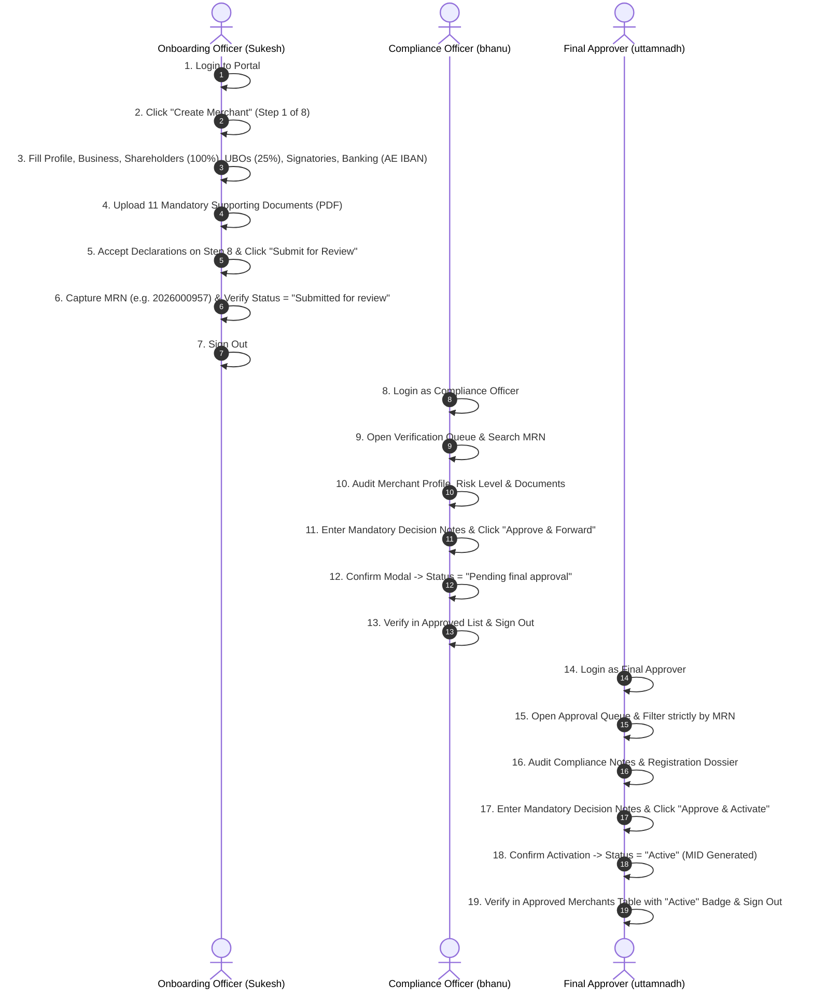
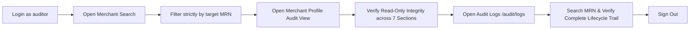

# ✨ QiPlus Positive (Happy Path) Test Suite Specification

> **Comprehensive Reference & Execution Guide**  
> **Target Application**: QiPlus Merchant Onboarding & Lifecycle Platform (`https://idms-uat.qiplus.ae`)  
> **Framework Architect**: **Bhanu Kiran** (QA Automation Lead)  
> **Stack**: Playwright + TypeScript + Allure 2 Report Engine  
> **Total Test Specs**: **4 Modular Specs** + **1 Consolidated Pipeline** across 3 Sequential User Roles

---

## 📑 Table of Contents

1. [Executive Summary & Multi-Role Pipeline](#1-executive-summary--multi-role-pipeline)
2. [Dynamic Data Generation Engine](#2-dynamic-data-generation-engine)
3. [Step-by-Step Onboarding Walkthrough (Steps 1 – 8)](#3-step-by-step-onboarding-walkthrough-steps-1--8)
   - [Step 1: Merchant Profile & Primary Contact](#step-1-merchant-profile--primary-contact)
   - [Step 2: Business Activities & Processing Volumes](#step-2-business-activities--processing-volumes)
   - [Step 3: Shareholder & Ownership Structure](#step-3-shareholder--ownership-structure)
   - [Step 4: Ultimate Beneficial Owners - UBOs](#step-4-ultimate-beneficial-owners--ubos)
   - [Step 5: Authorized Signatories & Authority](#step-5-authorized-signatories--authority)
   - [Step 6: Settlement Banking & IBAN Rules](#step-6-settlement-banking--iban-rules)
   - [Step 7: Supporting Document Uploads](#step-7-supporting-document-uploads)
   - [Step 8: Final Review & Submission Locks](#step-8-final-review--submission-locks)
4. [Compliance Review & Verification Workflow (Step 9)](#4-compliance-review--verification-workflow-step-9)
5. [Final Approver & Merchant Activation Workflow (Step 10)](#5-final-approver--merchant-activation-workflow-step-10)
6. [Multi-Role Status Transition Audit](#6-multi-role-status-transition-audit)
7. [Pipeline Guarding & Failure Interlocks](#7-pipeline-guarding--failure-interlocks)
8. [Execution Commands & Troubleshooting](#8-execution-commands--troubleshooting)

---

## 1. Executive Summary & Multi-Role Pipeline

The **QiPlus Positive Suite** validates the complete, end-to-end "Happy Path" lifecycle of a merchant on the QiPlus platform. The test verifies that a brand new merchant registration is created, filled with realistic UAE compliance data, submitted, reviewed, verified by Compliance, approved by the Final Approver, and successfully activated.



---

## 2. Dynamic Data Generation Engine

To guarantee zero collision and independent test runs, the positive test suite leverages a deterministic, seed-based dynamic data engine (`fixtures/test-data.ts` and `fixtures/merchant-data.ts`):

```
┌────────────────────────────────────────────────────────────────────────┐
│                   DYNAMIC DATA GENERATION CAPABILITIES                 │
├──────────────────────┬──────────────────────┬──────────────────────────┤
│ DATA ATTRIBUTE       │ GENERATION RULE      │ SAMPLE GENERATED VALUE   │
├──────────────────────┼──────────────────────┼──────────────────────────┤
│ Run Identifier (RUN) │ Timestamp / UUID     │ 1740000000000            │
│ Merchant Trade Name  │ Prefix + Type + Hash │ Pacific Ventures 0885    │
│ Merchant Legal Name  │ Trade Name + " LLC"  │ Pacific Ventures 0885 LLC│
│ Tax Reg. No (TRN)    │ 15 digits + Luhn     │ 100 7579 1021 3176       │
│ Trade Licence Number │ Prefix "TL" + Hash   │ TL-813822                │
│ Emirates ID (EID)    │ 784-YYYY-XXXXXXX-Z   │ 784-1992-1448568-4       │
│ Settlement IBAN      │ AE + 2 check + 19 al │ AE520335305065957162693  │
│ Settlement SWIFT/BIC │ 8 or 11 characters   │ EBILAEADXXX              │
│ Primary Email        │ Deterministic Seed   │ onboarding.0885@qiplus.ae│
└──────────────────────┴──────────────────────┴──────────────────────────┘
```

---

## 3. Step-by-Step Onboarding Walkthrough (Steps 1 – 8)

**Spec**: `tests/positive/02-onboarding-wizard.spec.ts`  
**Role**: Onboarding Officer (`Sukesh` / `Qa@12345`)

---

### Step 1: Merchant Profile & Primary Contact
- **Action**: Navigates to `/merchants/new`, opens Step 1.
- **Fields Populated**:
  - **Trade Name**: `Pacific Ventures 0885`
  - **Legal Name**: `Pacific Ventures 0885 LLC`
  - **Tax Registration (TRN)**: `100757910213176` (15-digit Luhn-compliant)
  - **Trade Licence No**: `TL-813822`
  - **Licence Issue Date**: `01/01/2020` (Valid past date)
  - **Licence Expiry Date**: `01/01/2030` (Valid future date)
  - **Business Activities**: Multiple selected (e.g. *General Trading*, *E-Commerce*)
  - **Address**: `Office 402, Al Saada Tower`, Dubai, UAE
  - **Primary Contact**: Full Name, UAE Mobile (`+971 50 123 4567`), Work Email
  - **VAT Registration**: `vatRegistered: false` or uploads mandatory VAT certificate.
- **Advancement**: Clicks `"Save & continue"`, captures initial `MRN` from header, asserts arrival on `Step 2 of 8`.

---

### Step 2: Business Activities & Processing Volumes
- **Action**: Configures operational model and financial projections.
- **Fields Populated**:
  - **Merchant Category Code (MCC)**: `5411 - Grocery Stores, Supermarkets`
  - **Business Description**: `"Online and in-store retail trading of consumer goods and electronics."`
  - **Expected Monthly Volume**: `500,000 AED`
  - **Expected Monthly Transaction Count**: `100`
  - **Average Ticket Size**: `5,000 AED`
  - **Operating Model**: `Hybrid (Physical + Online)`
  - **Website URL**: `https://pacificventures0885.ae`
- **Advancement**: Clicks `"Save & continue"`, asserts arrival on `Step 3 of 8`.

---

### Step 3: Shareholder & Ownership Structure
- **Action**: Populates legal ownership entities totaling exactly **100% shareholding**.
- **Interactive Choices**:
  - **`Individual`**:
    - Selects `Individual` from dropdown.
    - ID Type: `Emirates ID` (`784-YYYY-NNNNNNN-C`) or `Passport`.
    - **UBO Linkage**: When $\ge 25\%$, details automatically carry forward to Step 4.
  - **`Entity`**:
    - Selects `Entity` from dropdown.
    - Country of Registration: `United Arab Emirates`.
    - ID Type: `Trade License` radio button.
    - Trade Licence Number: `TL162770` (2 letters + 6 digits).
    - **UBO Linkage**: Details are **NOT** carried forward; natural person UBO must be populated manually in Step 4.
- **Advancement**: Clicks `"Save & continue"`, asserts arrival on `Step 4 of 8`.

---

### Step 4: Ultimate Beneficial Owners (UBOs)
- **Action**: Verifies shareholder linkage or fills independent natural person UBO KYC fields under UAE AML/CFT regulations.
- **Business Rules**:
  - **When Step 3 was `Individual`**: Auto carries forward name, nationality, ID number, and shareholding.
  - **When Step 3 was `Entity`**: All fields are empty and editable; test manually populates all 12 mandatory fields:
    1. `Full legal name (as per ID) *`
    2. `Date of birth *`
    3. `Place of birth *`
    4. `Nationality (primary) *`
    5. `Country of residence *`
    6. `% shareholding *` (100%)
    7. `ID type *` (`Emirates ID` / `Passport`)
    8. `Emirates ID number *`
    9. `ID expiry date *`
    10. `Basis of control *` (`Ownership`)
    11. `Occupation *`
    12. `Politically Exposed Person (PEP)` (checkbox)
- **Advancement**: Clicks `"Save & continue"`, asserts arrival on `Step 5 of 8`.

---

### Step 5: Authorized Signatories & Authority
- **Action**: Fills individuals authorized to execute contracts and operate accounts.
- **Fields Populated**:
  - **Signatory Name**: `John Shareholder`
  - **Designation**: `Chief Executive Officer`
  - **Nationality**: `United Arab Emirates`
  - **Emirates ID**: `784-1990-1234567-1`
  - **Scope of Authority**: `Sole Authority`
  - **Primary Signatory Flag**: `true` (Checked)
- **Advancement**: Clicks `"Save & continue"`, asserts arrival on `Step 6 of 8`.

---

### Step 6: Settlement Banking & IBAN Rules
- **Action**: Configures UAE domestic bank account for transaction settlement.
- **Fields Populated**:
  - **Account Holder Name**: `Pacific Ventures 0885 LLC`
  - **Bank Name**: `Emirates NBD`
  - **Account Number**: `102345678901`
  - **SWIFT / BIC Code**: `EBILAEADXXX` (11 characters)
  - **IBAN**: `AE520335305065957162693` (23-character MOD-97 verified UAE IBAN)
  - **Settlement Currency**: `AED - UAE Dirham`
- **Advancement**: Clicks `"Save & continue"`, asserts arrival on `Step 7 of 8`.

---

### Step 7: Supporting Document Uploads
- **Action**: Sequential upload across all **17 document slots** using valid image assets (`dummy_1.png`).
- **Validation & Verification**:
  - Direct file input targeting ensures every mandatory slot receives a valid file.
  - Verifies that the top alert banner (`⚠ 11 mandatory documents still needed before submission`) is **completely cleared**.
  - Asserts `Save & continue` button is enabled.
- **Advancement**: Clicks `"Save & continue"`, asserts arrival on `Step 8 of 8`.

---

### Step 8: Final Review & Submission Locks
- **Action**: Verifies all captured summary data, captures the active MRN, accepts declarations, and submits.
- **Verification & Submission**:
  - Captures `MRN` (`609011...`) directly from page header / review dossier.
  - Submits record for review.
  - Verifies record status transition in the **Submitted** section.
  - Prints formatted terminal summary banner and saves MRN to `fixtures/state.json`.
  - Signs out cleanly.

---

## 4. Compliance Review & Verification Workflow (Step 9)

**Spec**: `tests/positive/03-compliance-review.spec.ts`  
**Role**: Compliance Officer (`bhanu` / `Qa@123456789`)

```mermaid
flowchart LR
    A[Login as bhanu] --> B[Open Verification Queue]
    B --> C[Filter strictly by target MRN]
    C --> D[Open Merchant Audit View]
    D --> E[Review Risk & Documents]
    E --> F[Enter Decision Notes: Verified]
    F --> G[Click Approve & Forward]
    G --> H[Confirm Modal -> Status: Pending final approval]
    H --> I[Verify in Approved List & Logout]
```



### Verification Highlights:
- **Strict Filter Enforcement**: Searches strictly for the generated MRN (fails if missing; no fallback to stale rows).
- **Mandatory Decision Notes**: Submits compliance clearance notes (*"KYC/AML checks completed, verified UBO structure and Trade Licence with DED"*).
- **Status Assertion**: Verifies status transitions to **`Pending final approval`** and moves from Verification Queue to Approved tab.

---

## 5. Final Approver & Merchant Activation Workflow (Step 10)

**Spec**: `tests/positive/04-final-approval.spec.ts`  
**Role**: Final Approver (`uttamnadh` / `Qa@123456789`)

```mermaid
flowchart LR
    A[Login as uttamnadh] --> B[Open Approval Queue]
    B --> C[Filter strictly by target MRN]
    C --> D[Open Merchant Review]
    D --> E[Audit Compliance Notes & Profile]
    E --> F[Enter Decision Notes: Final Approval]
    F --> G[Click Approve & Activate]
    G --> H[Confirm Modal -> Status: Active]
    H --> I[Verify in Approved Merchants Table & Logout]
```



### Activation Highlights:
- **Compliance Clearance Check**: Approver verifies notes logged by Compliance Officer are visible in the decision dossier.
- **Merchant ID (MID) Generation**: Approval activates merchant payment gateways and assigns a permanent MID.
- **Badge Assertion**: Asserts the status chip in the **Approved Merchants** table displays **`Active`**.

---

## 6. Auditor Review & Verification Workflow (Step 11)

**Spec**: `tests/positive/05-auditor.spec.ts`  
**Role**: Auditor (`auditor` / `Passw0rd!`)



### Auditor Capabilities & Verification Scope:
- **Merchant Directory Search**: Verifies that the activated MRN is indexed in the global Merchant Search directory with matching Legal Name, Enrollment Officer (`Sukesh`), submission date, and status.
- **Read-Only Profile Integrity**: Clicks the merchant row to open `/merchants/<mrn>` and asserts the read-only presentation across 7 core audit sections:
  1. `Registration` (TRN, Incorporation Date, Country)
  2. `Licence` (Authority, Number, Validity Dates)
  3. `Contact & banking` (Authorized Contact, Phone, IBAN)
  4. `Business profile` (Volumes, Activity, Countries)
  5. `Ownership & control` (Shareholders, UBOs, Signatories)
  6. `Submitted documents` (All 16 supporting documents)
  7. `Activity history` (Chronological timeline)
- **Lifecycle Audit Trail (`/audit/logs`)**: Filters the audit log table by target MRN and asserts the presence of all chronological events (`Create merchant`, `Save profile step`, `Save banking step`, `Submit documents bulk`, `Submit merchant`, `Emcrey screen`, `Review merchant`, and approver activations) with `Success` status.

---

## 7. Pipeline Guarding & Failure Interlocks

To prevent cascading test failures and unnecessary authentication requests:

```typescript
// fixtures/merchant-data.ts State Guarding
const state = loadState();
if (!state.submitted || !state.mrn) {
  test.skip(true, 'Skipping downstream reviewer tests: Onboarding wizard did not submit cleanly.');
}
```

- If `02-onboarding-wizard.spec.ts` encounters an unexpected blocker:
  - Downstream reviewer specs (`03-compliance-review.spec.ts` and `04-final-approval.spec.ts`) **skip cleanly without executing logins or generating false-negative failures**.

---

## 7. Execution Commands & Troubleshooting

### 🚀 Interactive Batch Runner (Multi-Record Onboarding)

```powershell
# Interactive prompt for Shareholder Mode (Individual / Entity / Alternate), Record Count (1, 2, 3, 5, 10+), and Browser Mode:
npm run wizard
```

### 📋 Direct Execution Commands

```powershell
# 1. Run full positive pipeline (All 4 specs in serial order)
npx playwright test tests/positive/

# 2. Run positive pipeline in headed mode (Watch browser execution live)
npx playwright test tests/positive/ --headed

# 3. Run only the Onboarding Wizard spec
npx playwright test tests/positive/02-onboarding-wizard.spec.ts --headed

# 4. Run Compliance Review spec
npx playwright test tests/positive/03-compliance-review.spec.ts --headed

# 5. Run Final Approval & Activation spec
npx playwright test tests/positive/04-final-approval.spec.ts --headed

# 6. Run Auditor Verification & Audit Logs spec
npx playwright test tests/positive/05-auditor.spec.ts --headed

# 7. Generate and open Allure HTML Report with historical trends
npm run allure:generate
npm run allure:open
```

### 🔧 Best Practices:
- Always run the positive suite with `workers: 1` or in serial mode to preserve state continuity across the 3 user roles.
- Ensure `dummy_1.png` and test fixtures exist in `fixtures/` for document batch uploads.

